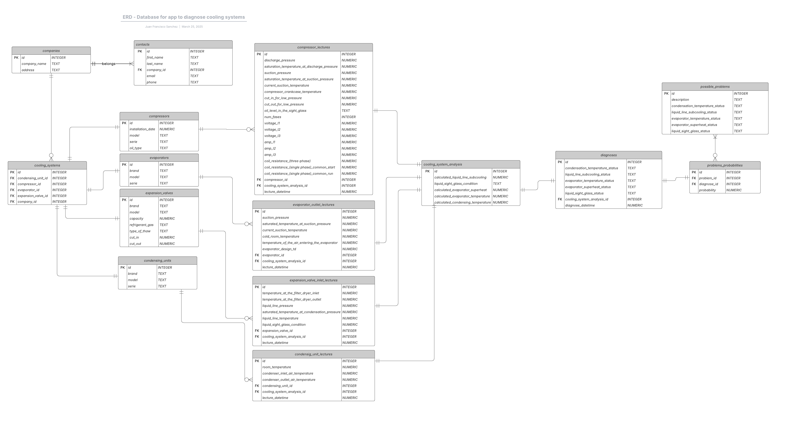

# Database-Cooling-System-Diagnostics
SQL schema for a database that stores data for a cooling systems diagnostics app

# Design Document

By JUAN FRANCISCO SANCHEZ MALDONADO

Video overview: <URL [HERE](https://youtu.be/UqrxB1eBkfs) >

## Scope

The database for CS50 SQL includes all entities necessary to facilitate the diagnosis process of cooling systems in our clients' businesses. As such, included in the database's scope is:
- Companies: These are the entities to which the cooling systems are associated. Each company has attributes like name and address.
- Contacts: These represent individuals who are associated with the companies. Each contact has details such as first name, last name, email, phone number, and their associated company.
- Cooling Systems: These are the systems that use components like condensing units, compressors, evaporators, and expansion valves. Cooling systems have references to various components and are linked to a specific company.
- Condensing Units: These are components of the cooling system. Each condensing unit has attributes like brand, model, and serial number.
- Compressors: These are another key component of the cooling system, each with attributes like installation date, model, serial number, and oil type.
- Evaporators: A part of the cooling system, each evaporator is identified by its brand, model, and serial number.
- Expansion Valves: Another component of the cooling system, with attributes like brand, model, capacity, refrigerant gas, thaw type, and operational cut-in and cut-out pressures/temperatures.
- Cooling System Analysis: This stores the analysis data related to cooling systems, including calculated values for subcooling, superheat, and temperatures for the system components.
- Lectures/Measurements for Components: These tables store lecture/measurement data for each component (condensing units, compressors, evaporators, expansion valves), such as temperatures, pressures, and other technical details, providing a record of the system's performance at specific times.
- Diagnoses: This table stores the diagnoses of the cooling system, including various status checks for system conditions like condensation temperature, evaporator temperature, and liquid line subcooling.
- Possible Problems: This table outlines potential problems in the system, such as issues with condensation temperature, evaporator temperature, and sight glass conditions.
- Problem Probabilities: It links potential problems to diagnoses, capturing the probability of a certain problem based on the diagnosis made.

Out of scope are elements like:
- Multiple Evaporators per Cooling System: As mentioned, the database currently supports only one evaporator per cooling system. If a system uses multiple evaporators, this relationship is not captured.
- Detailed Location of Equipment: The database only includes the company's office address but does not capture specific operational or equipment locations, which might be important for tracking where the cooling systems are installed or operated.
- Operational History of Equipment: The database does not track the operational history of the equipment (for example: runtime hours, maintenance logs, or repair history). This could be relevant for long-term system performance monitoring but is currently outside the scope.
- Equipment Performance Over Time: The database does not track historical performance metrics for each component or cooling system. Data like long-term trends or performance degradation over time is not included.
- Equipment Maintenance or Service Schedules: There is no tracking of maintenance schedules or service records for the condensing units, compressors, evaporators, or expansion valves, which would help in managing the equipment's lifecycle.
- Service Technicians: The database does not store information about technicians or engineers performing maintenance or repairs, which could be useful for tracking who handled a particular service request or installation.
- Supplier Information: Details about the suppliers or manufacturers of the various components (condensing units, compressors, evaporators, expansion valves) are not included. Supplier relationships or warranties may be relevant in certain contexts.
- Operational Parameters/Settings for the System: The database does not capture the detailed configuration or operational parameters set in the cooling system, such as pressure, temperature set points, or operational modes.
- Real-time Sensor Data: The database does not store real-time sensor data (for example: from pressure, temperature, or flow sensors) which would be valuable for monitoring the cooling system's performance in real-time.
- System Interdependencies: The database does not capture the interdependencies or relationships between different components in the system (for example: how a specific compressor's performance affects the evaporator or condensing unit).
- Energy Consumption/Costs: The database does not track the energy consumption or cost analysis of operating the cooling systems or individual components, which could be valuable for efficiency monitoring and cost management.

## Functional Requirements

- A user should be able to retrieve and view detailed information about companies, including their name and address.
- A user should be able to access and view the contact information of the people associated with companies (fpr example: first name, last name, email, phone number).
- Users should be able to view the details of equipment such as condensing units, compressors, evaporators, and expansion valves, including their brand, model, and serial numbers.
- Users should be able to retrieve and view cooling system analysis results, including calculated subcooling, superheat, evaporator and condensing temperatures, and the condition of the liquid sight glass.
- The database should allow users to view diagnoses that are automatically generated based on the cooling system analysis data.
- Users should be able to check the conditions identified in the cooling system analysis, as these help determine the state of the system.
- Users should be able to view a list of potential problems (from the possible_problems table) that might occur, with descriptions of what the problems represent.
- Users should be able identify automatically the problems that match with the identified conditions.
- Users should be able to view the number of condition matches for each problem. This helps identify the problem for his likelihood.
- Users should be able to query and generate reports on the cooling system's condition, diagnoses, and problems. This could include filtering based on date, company, equipment type, or problem match probability.
- Users should be able to track and view historical data for the performance of equipment, cooling system analysis, and diagnoses to monitor long-term trends.

Beyond the scope:
- Users should not be able to manually enter or modify the cooling system analysis data. Since this data is automatically generated using triggers based on system conditions, users should not override or manually change this information.
- Users should not be able to directly modify the diagnoses or the entries in the possible_problems table. These diagnoses are calculated and generated based on system data, so any modifications should be limited to system-generated reports and outputs.
- Users should not be allowed to modify the logic of the triggers or the way conditions, diagnoses, and problems are calculated. The database should handle all these automated actions based on predefined rules.
- Users should not have the ability to edit or manage maintenance schedules or histories for equipment within this database since maintenance tracking is not currently within the database’s scope.
- The probability values and match counts derived from condition matching to problems should be strictly automated. Users should not be able to alter or manually calculate these values, as they are based on predefined logic and the conditions provided by the analysis.
- Users cannot manage or track the exact location of the equipment (for example: operational sites or installation areas), as this is out of scope based on the current design of the database.
- Users cannot manage or track the exact location of the equipment (for example: operational sites or installation areas), as this is out of scope based on the current design of the database.

## Representation

### Entities

The database includes the following entities:

#### COMPANIES

The `companies` table includes:

* `id`: Specifies the unique ID for each company as an `INTEGER`. This column has the `PRIMARY KEY` constraint applied, ensuring each company has a unique identifier.
* `company_name`: Specifies the name of the company as `TEXT`. This is appropriate because company names are textual data and should be stored as such.
* `address`: Specifies the address of the company as `TEXT`. Addresses are typically stored as free-text fields, and `TEXT` is chosen for flexibility.

`INTEGER` is chosen for id to uniquely identify companies. `TEXT` is appropriate for names and addresses as they are character strings. `PRIMARY KEY` on id ensures each company has a unique identifier, which is necessary for relationships with other tables. No other constraints are applied as both `company_name` and address are essential but not required to be unique.

### COOLING SYSTEM ANALYSIS

The `cooling_system_analysis` table includes:

* `id`: Specifies the unique ID for each cooling system analysis as an `INTEGER`, with the `PRIMARY KEY` constraint applied to ensure uniqueness.
* `calculated_liquid_line_subcooling`: Specifies the subcooling measurement in the liquid line as `NUMERIC(6,2)`. This ensures precision with up to 6 digits, including 2 decimal places.
* `liquid_sight_glass_condition`: Specifies the condition of the liquid sight glass as `TEXT`. The allowed values are restricted to `full`, `bubbles`, and `NULL`. A `CHECK` constraint is used to limit the possible values.
* `calculated_evaporator_superheat`: Specifies the superheat measurement at the evaporator as `NUMERIC(6,2)`, ensuring precision for cooling system diagnostics.
* `calculated_evaporator_temperature`: Specifies the temperature at the evaporator as `NUMERIC(6,2)`.
* `calculated_condensing_temperature`: Specifies the temperature at the condenser as `NUMERIC(6,2)`.

`NUMERIC(6,2)` ensures precision for scientific and engineering data, with specific digits before and after the decimal point. `TEXT` is used for the condition of the sight glass as it's a categorical description.The `CHECK` constraint on `liquid_sight_glass_condition` ensures data consistency by limiting values to valid ones. `PRIMARY KEY` ensures each entry is unique.

### CONTACTS

The `contacts` table includes:
* `id`: Specifies the unique ID for each contact as an INTEGER, with the PRIMARY KEY constraint applied.
* `first_name`: Specifies the first name of the contact as `TEXT`, suitable for character data.
* `last_name`: Specifies the last name of the contact as `TEXT`, similar to `first_name`.
* `company_id`: Specifies the foreign key that links each contact to a company, stored as an `INTEGER`. This column references id from the companies table and has the `ON DELETE CASCADE` action, meaning if a company is deleted, all its contacts will also be deleted.
* `email`: Specifies the email of the contact as `TEXT`. The `UNIQUE` constraint ensures no two contacts share the same email address.
* `phone`: Specifies the phone number of the contact as `TEXT` beacause the number may start with 0. The `UNIQUE` constraint ensures no two contacts share the same phone number.

`TEXT` is used for names, email, and phone as they are character-based fields. `INTEGER` is used for the foreign key to ensure it points to valid company records.The `PRIMARY KEY` ensures each contact is unique. The `FOREIGN KEY` constraint ensures that a contact is associated with a valid company. The `ON DELETE CASCADE` ensures integrity when a company is deleted. `UNIQUE` constraints ensure that emails and phone numbers are not duplicated.

### CONDENSING UNITS

The `condensing_units` table includes:
* `id`: Specifies the unique ID for each condensing unit as an `INTEGER`, with the `PRIMARY KEY` constraint applied.
* `brand`: Specifies the brand of the condensing unit as `TEXT`, which is appropriate for product names.
* `model`: Specifies the model number of the condensing unit as `TEXT`.
* `serie`: Specifies the serial number of the condensing unit as `TEXT`.

`TEXT` is used for `brand`, `model`, and `serie` as these fields store text-based identifiers. The `PRIMARY KEY` ensures that each condensing unit has a unique identifier.

### COMPRESSORS

The `compressors` table includes:
* `id`: Specifies the unique ID for each compressor as an `INTEGER`, with the PRIMARY KEY constraint applied.
* `installation_date`: Specifies the installation date as `NUMERIC` (storing it as a timestamp). The default value is the current timestamp (`DEFAULT CURRENT_TIMESTAMP`).
* `model`: Specifies the model of the compressor as `TEXT`.
* `serie`: Specifies the serial number of the compressor as `TEXT`.
* `oil_type`: Specifies the oil type used in the compressor as `TEXT`.

`NUMERIC` is used for the installation date to store it as a timestamp, while `TEXT` is used for the model, serial number, and oil type. `DEFAULT CURRENT_TIMESTAMP` is used to automatically set the installation date when a new compressor is added, ensuring that this field has a sensible default.

### EVAPORATORS

The `evaporators` table includes:
* `id`: Specifies the unique ID for each evaporator as an `INTEGER`, with the `PRIMARY KEY` constraint applied.
* `brand`: Specifies the brand of the evaporator as `TEXT`.
* `model`: Specifies the model number of the evaporator as `TEXT`.
* `serie`: Specifies the serial number of the evaporator as `TEXT`.

`TEXT` is used for the brand, model, and serial number of the evaporator as they are textual information. The `PRIMARY KEY` ensures each evaporator has a unique identifier.

### EXPANSION VALVES

The `expansion_valves` table includes:
* `id`: Specifies the unique ID for each expansion valve as an `INTEGER`, with the `PRIMARY KEY` constraint applied.
* `brand`: Specifies the brand of the expansion valve as `TEXT`.
* `model`: Specifies the model of the expansion valve as `TEXT`.
* `capacity`: Specifies the cooling capacity of the valve as `NUMERIC(10,2)`, which allows for values with up to 10 digits, including 2 decimal places.
* `refrigerant_gas`: Specifies the type of refrigerant gas the valve is designed for as `TEXT`.
* `type_of_thaw`: Specifies the type of defrosting mechanism used in the valve as `TEXT`.
* `cut_in`: Specifies the temperature level where the valve activates as `NUMERIC(6,2)`.
* `cut_out`: Specifies the temperature level where the valve stops operation as `NUMERIC(6,2)`.

 `NUMERIC` is used for attributes related to capacity, cut-in, and cut-out points to ensure precision. `TEXT` is used for attributes like brand, model, refrigerant gas, and thaw type as these are textual data. The `PRIMARY KEY` ensures each valve has a unique identifier.

 ### COOLING SYSTEMS

The `cooling_systems` table includes:
* `id`: Specifies the unique ID for each cooling system as an `INTEGER`. This column has the `PRIMARY KEY` constraint applied.
* `condensing_unit_id`: Specifies the associated condensing unit as an `INTEGER`. A `UNIQUE` constraint ensures that each condensing unit is linked to only one cooling system. This column has a `FOREIGN KEY` reference to "condensing_units"("id").
* `compressor_id`: Specifies the associated compressor as an `INTEGER`. A `UNIQUE` constraint ensures that each compressor is linked to only one cooling system. This column has a `FOREIGN KEY` reference to "compressors"("id").
* `evaporator_id`: Specifies the associated evaporator as an `INTEGER`. A `UNIQUE` constraint ensures that each evaporator is linked to only one cooling system. This column has a `FOREIGN KEY` reference to "evaporators"("id").
* `expansion_valve_id`: Specifies the associated expansion valve as an `INTEGER`. A `UNIQUE` constraint ensures that each expansion valve is linked to only one cooling system. This column has a `FOREIGN KEY` reference to "expansion_valves"("id").
* `company_id`: Specifies the company that owns or manages the cooling system as an `INTEGER`. This column has a `FOREIGN KEY` reference to "companies"("id") with the `ON DELETE CASCADE` constraint, ensuring that if a company is deleted, its associated cooling systems are also removed.

### COMPRESSOR LECTURES

The `compressor_lectures` table includes:
* `id`: Specifies the unique ID for each compressor lecture as an `INTEGER`. This column has the `PRIMARY KEY` constraint applied.
* `discharge_pressure`: Specifies the discharge pressure as a `NUMERIC(6,2)` value, ensuring precision up to two decimal places.
* `saturation_temperature_at_discharge_pressure`: Specifies the saturation temperature at discharge pressure as a `NUMERIC(6,2)` value.
* `suction_pressure`: Specifies the suction pressure as a `NUMERIC(6,2)` value.
* `saturation_temperature_at_suction_pressure`: Specifies the saturation temperature at suction pressure as a `NUMERIC(6,2)` value.
* `current_suction_temperature`: Specifies the current suction temperature as a `NUMERIC(6,2)` value.
* `compressor_crankcase_temperature`: Specifies the compressor crankcase temperature as a `NUMERIC(6,2)` value.
* `cut_in_for_low_pressure`: Specifies the cut-in pressure for low-pressure operation as a `NUMERIC(6,2)` value.
* `cut_out_for_low_pressure`: Specifies the cut-out pressure for low-pressure operation as a `NUMERIC(6,2)` value.
* `oil_level_in_the_sight_glass`: Specifies the oil level as a `TEXT` value, restricted to predefined values: `empty`, `1/2`, `1/4`, `3/4`, `full`. The `CHECK` constraint ensures only these values are allowed.
* `num_phases`: Specifies the number of phases as a `TEXT` value, restricted to either `single phase` or `three phase`. The `CHECK` constraint ensures only these values are allowed.
* `voltage_l1`: Specifies the voltage in L1 phase as a `NUMERIC(6,2)` value.
* `voltage_l2`: Specifies the voltage in L2 phase as a `NUMERIC(6,2)` value.
* `voltage_l3`: Specifies the voltage in L3 phase as a `NUMERIC(6,2)` value.
* `amp_l1`: Specifies the amperage in L1 phase as a `NUMERIC(6,2)` value.
* `amp_l2`: Specifies the amperage in L2 phase as a `NUMERIC(6,2)` value.
* `amp_l3`: Specifies the amperage in L3 phase as a `NUMERIC(6,2)` value.
* `coil_resistance_(three-phase)`: Specifies the coil resistance for a `three-phase `compressor as a `NUMERIC(6,2)` value.
* `coil_resistance_(single-phase)_common_start`: Specifies the coil resistance between common and start for a `single-phase` compressor as a `NUMERIC(6,2)` value.
* `coil_resistance_(single-phase)_common_run`: Specifies the coil resistance between common and run for a `single-phase` compressor as a `NUMERIC(6,2)` value.
* `compressor_id`: Specifies the associated compressor as an `INTEGER`. This column has a `FOREIGN KEY` reference to "compressors"("id") with the `ON DELETE CASCADE` constraint.
* `cooling_system_analysis_id`: Specifies the related cooling system analysis as an `INTEGER`. A `UNIQUE` constraint ensures each analysis corresponds to one lecture. This column has a `FOREIGN KEY` reference to "cooling_system_analysis"("id") with the `ON DELETE CASCADE` constraint.
* `lecture_datetime`: Specifies the timestamp of the lecture as a `NUMERIC` value. The default value is `CURRENT_TIMESTAMP`, ensuring automatic timestamping when a lecture is recorded.

### EXPANSION VALVE INLET LECTURES

The `expansion_valve_inlet_lectures` table includes:

* `id`: Specifies the unique identifier of the lecture as an `INTEGER`, with a `PRIMARY KEY` constraint.
* `temperature_at_the_filter_dryer_inlet`, `temperature_at_the_filter_dryer_outlet`, `liquid_line_pressure`, `saturated_temperature_at_condensation_pressure`, `liquid_line_temperature`: These are `NUMERIC(6,2)` values, ensuring precision up to two decimal places.
* `liquid_sight_glass_condition`: Specifies the condition of the liquid sight glass as a `TEXT` value. A `CHECK` constraint ensures that only `full` or `bubbles` are accepted.
* `expansion_valve_id`: References the expansion valve as an `INTEGER`, with a `FOREIGN KEY` constraint and `ON DELETE CASCADE` to ensure related records are removed if the expansion valve is deleted.
* `cooling_system_analysis_id`: References the cooling system analysis as an `INTEGER`, with `FOREIGN KEY`, `UNIQUE`, and `ON DELETE CASCADE` constraints. The `UNIQUE` constraint ensures each analysis corresponds to only one lecture.
* `lecture_datetime`: Stores the date and time of the lecture as a `NUMERIC` value, with a default value of `CURRENT_TIMESTAMP` to automatically record the timestamp when a lecture is created.

### EVAPORATOR OUTLET LECTURES

The `evaporator_outlet_lectures` table includes:

* `id`, which specifies the unique identifier of the reading as an `INTEGER`, with `PRIMARY KEY`.
* `suction_pressure`, `saturated_temperature_at_suction_pressure`, `current_suction_temperature`, `cold_room_temperature`, `temperature_of_the_air_entering_the_evaporator`, `evaporator_design_td` are numerical values with `NUMERIC(6,2)`.
* `evaporator_id`, which references the evaporator as an `INTEGER`, with `FOREIGN KEY` and `ON DELETE CASCADE`.
* `cooling_system_analysis_id`, which references the cooling system analysis as an `INTEGER`, with `FOREIGN KEY`, `UNIQUE`, and `ON DELETE CASCADE`.
* `lecture_datetime`, which stores the date and time of the reading as `NUMERIC`, with `DEFAULT CURRENT_TIMESTAMP`.

### CONDENSING UNIT LECTURES

The `condensing_unit_lectures` table includes:

* `id`, which specifies the unique identifier of the reading as an `INTEGER`, with `PRIMARY KEY`.
* `room_temperature`, `condenser_inlet_air_temperature`, `condenser_outlet_air_temperature` are numerical values with `NUMERIC(6,2)`.
* `condensing_unit_id`, which references the condensing unit as an `INTEGER`, with `FOREIGN KEY` and `ON DELETE CASCADE`.
* `cooling_system_analysis_id`, which references the cooling system analysis as an `INTEGER`, with `FOREIGN KEY`, `UNIQUE`, and `ON DELETE CASCADE`.
* `lecture_datetime`, which stores the date and time of the reading as `NUMERIC`, with `DEFAULT CURRENT_TIMESTAMP`.

### DIAGNOSES

The `diagnoses` table includes:

* `id`, which specifies the unique identifier of the diagnosis as an `INTEGER`, with `PRIMARY KEY`.
* `condensation_temperature_status`, `liquid_line_subcooling_status`, `evaporator_temperature_status`, `evaporator_superheat_status`, `liquid_sight_glass_status` are `TEXT` attributes with a `CHECK` constraint to accept only the values `high`, `normal`, `low`, or `NULL`.
* `cooling_system_analysis_id`, which references the cooling system analysis as an `INTEGER`, with `FOREIGN KEY`, `UNIQUE`, and `ON DELETE CASCADE`.
* `diagnose_datetime`, which stores the date and time of the diagnosis as `NUMERIC`, with `DEFAULT CURRENT_TIMESTAMP`.

### POSSIBLE PROBLEMS

The `possible_problems` table includes:

* `id`, which specifies the unique identifier of the possible problem as an `INTEGER`, with `PRIMARY KEY`.
* `description`, which describes the problem as `TEXT`.
* `condensation_temperature_status`, `liquid_line_subcooling_status`, `evaporator_temperature_status`, `evaporator_superheat_status`, `liquid_sight_glass_status` are `TEXT` attributes with a `CHECK` constraint to accept only '`high`', `normal`, `low`, or `NULL`.

### PROBLEM PROBABILITIES

The `problems_probabilities` table includes:

* `id`, which specifies the unique identifier of the problem probability as an `INTEGER`, with `PRIMARY KEY`.
* `problem_id`, which references a possible problem as an `INTEGER`, with `FOREIGN KEY` and `ON DELETE CASCADE`.
* `diagnose_id`, which references a diagnosis as an `INTEGER`, with `FOREIGN KEY` and `ON DELETE CASCADE`.
* `probability`, which specifies the probability of the problem as `NUMERIC(6,2)`.

### Relationships

The below entity relationship diagram describes the relationships among the entities in the database.

As detailed by the diagram:

* Each company (companies) can have multiple contacts (contacts).
* contacts contains company_id as a foreign key, establishing a one-to-many relationship.
* A cooling system (cooling_systems) consists of:
    - One condensing unit (condensing_units).
    - One compressor (compressors).
    - One evaporator (evaporators).
    - One expansion valve (expansion_valves).
    - A reference to a company (company_id), linking the system to a company.
* compressor_lectures stores performance metrics for compressors and links to compressors and cooling_system_analysis.
* expansion_valve_inlet_lectures tracks expansion valve readings, linking to expansion_valves and cooling_system_analysis.
* evaporator_outlet_lectures logs evaporator outlet measurements.
* condensing_unit_lectures records condensing unit readings.
* cooling_system_analysis calculates performance metrics based on data from compressor_lectures, expansion_valve_inlet_lectures, evaporator_outlet_lectures, and condensing_unit_lectures.
* diagnoses stores diagnostic results linked to cooling_system_analysis.

## Optimizations

- Index for companies(company_name) because is used to find the name of the company when the user wants to relate data with the name of a company.
- Index for cooling_systems(company_id) because it is used on subqueries to find condensig_unit_id, compressor_id
- Index for cooling_systems for each component to find faster the related parts of a cooling system
- Index for diagnoses(cooling_system_analysis_id) because it is used in “WHERE diagnose_id” to relate a determined analysis with the diagnoses and filter the “problems_possibilities” table
- Index for problems_probabilities(diagnose_id, probability) to improve the search and the order by on a frequent query like looking in “problems_possibilities” table
- Index for lectures that are filtered by cooling_system_analysis_id because is the way to relate diagnoses with cooling systems and then with companies.

## Limitations

- The design assumes that each cooling system can have only one evaporator, which may not reflect more complex systems where multiple evaporators exist. This could limit the ability to accurately represent real-world systems with multi-evaporator configurations. If the system design changes in the future or if more complex cooling systems are required, this constraint may need to be revisited.
- While the database tracks equipment and components (like condensing unit, compressor, evaporator), it doesn't include detailed maintenance logs or histories for these items.This might affect the ability to track the health and lifecycle of equipment over time. For example, you won't know the exact number of times a compressor or evaporator has been serviced, which could be useful for predictive maintenance or tracking recurring issues.
- The analysis results are based on fixed calculations for conditions like subcooling, superheat, and temperatures. The database might not accommodate dynamic or continuous updates to these results in real-time.
- The database contains a predefined list of possible problems, and problems are associated with condition combinations. This could limit the ability to adapt to new or unexpected problems that don't fit the current combinations.
- The design relies on combining multiple conditions to identify specific problems, but it does not include a flexible mechanism for dynamically adding new conditions or changing the relationships between conditions and problems.
- While there are foreign keys and some basic constraints (like NOT NULL and UNIQUE), there is no deep enforcement of domain-specific rules, such as ensuring that certain values fall within realistic ranges or that certain combinations of data are logically valid (for example: a compressor installation date cannot be after the cooling system installation date).
- The database is designed to represent relationships between entities in a straightforward way (for example, a company has multiple contacts, a cooling system has multiple components). However, more complex relationships, such as interactions between different components of the system that impact each other’s performance, are not represented in great depth. In systems with interconnected parts (for example, multiple cooling units operating together, or components that influence each other's behavior), the database may fail to capture the full complexity of these interactions.

